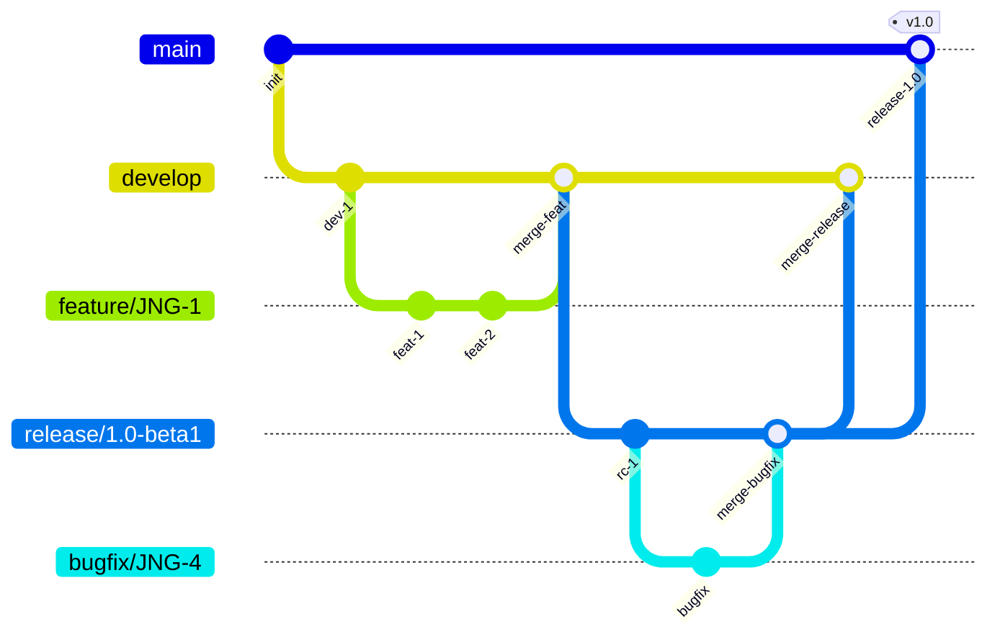
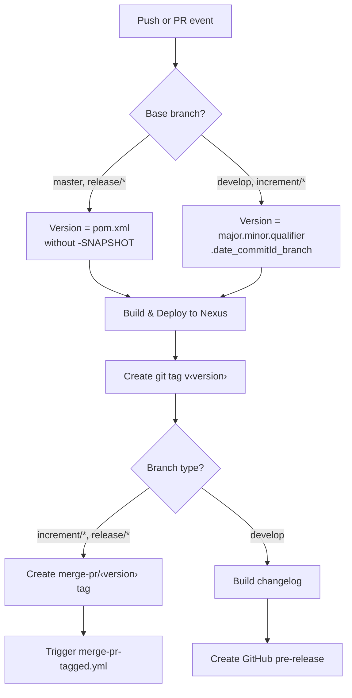
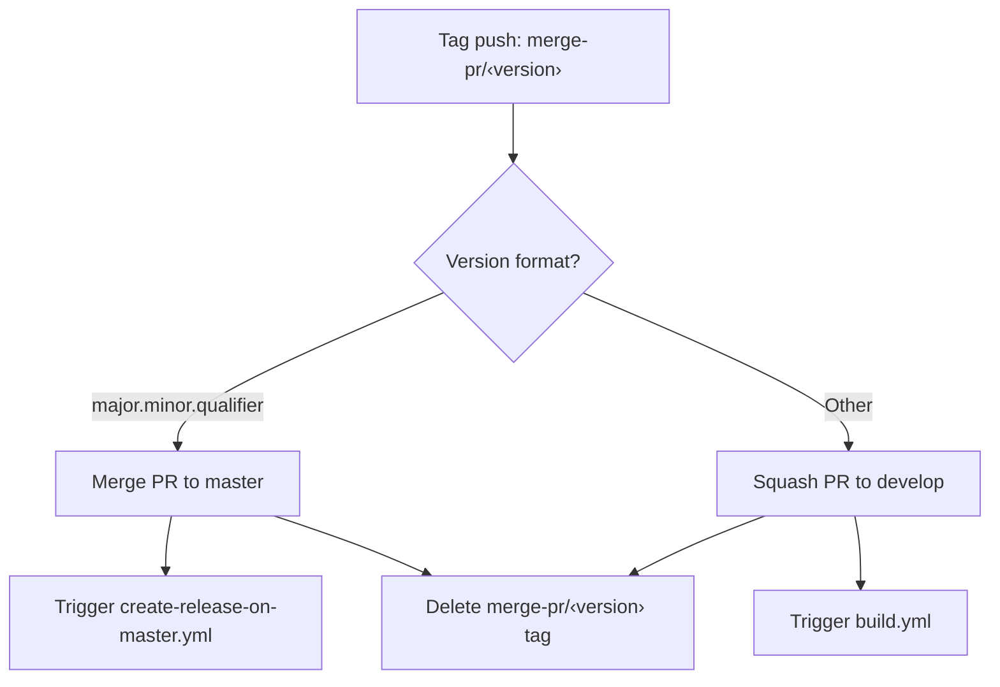
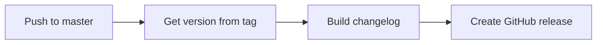
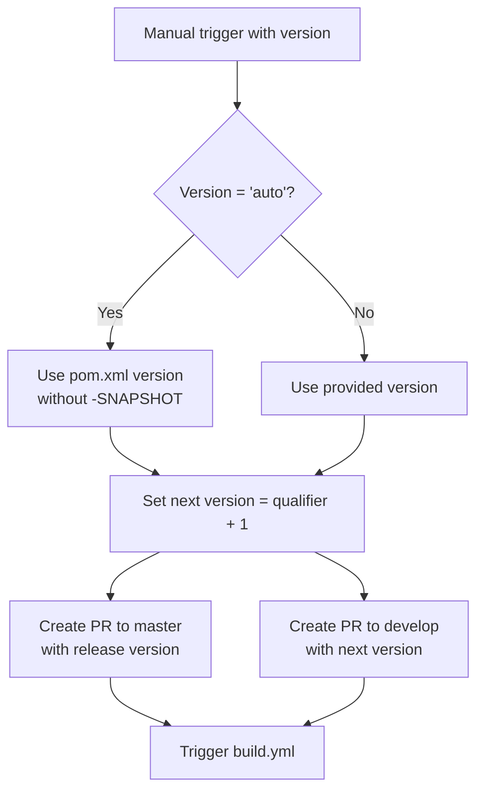

# CI Flow and Branch Strategy

This document describes the Git branching model and CI/CD pipeline for the structured-map-proxy project. The workflow is based on [GitFlow](https://www.atlassian.com/git/tutorials/comparing-workflows/gitflow-workflow).

## Branch Model

The project uses five types of branches, each with a specific role in the development lifecycle:

| Branch | Pattern | Based On | Purpose |
|---|---|---|---|
| **develop** | `develop` | — | Main development branch; always contains the latest in-progress work |
| **feature** | `feature/JNG-<number>_short_summary` | `develop` | New features for the next release |
| **release** | `release/<version>` or `<version>` | `develop` | Stabilization and testing before a production release |
| **bugfix** | `bugfix/JNG-<number>_short_summary` | release branch | Fixes applied during release testing (merged back to release and develop) |
| **support** | `support/JNG-<number>_short_summary` | release branch | Minor changes to a previous release (merged back to its release branch) |
| **hotfix** | `hotfix/JNG-<number>_short_summary` | `master` | Critical fixes applied to both `master` and `develop` |
| **master** | `master` | — | Latest released production version |

## Version Numbering

The project uses **semantic versioning** with up to four segments: `major.minor.qualifier.micro`.

| Event | Version Change | Example |
|---|---|---|
| Start a feature branch | No change | stays `2.0.0-SNAPSHOT` |
| Start a release branch from develop | Increment 2nd number on develop | develop → `2.1.0-SNAPSHOT` |
| Bugfix on release branch | No change | stays at release version |
| Start a support branch | Increment 3rd number | `1.0.1-SNAPSHOT` |
| Start a hotfix branch | Increment 4th number | `1.0.0.1-SNAPSHOT` |

## CI Pipeline (GitHub Actions)

### build.yml — Main Build

Triggered on pushes to `develop` and pull requests targeting `develop`, `master`, `increment/*`, or `release/*`.

### merge-pr-tagged.yml — PR Merge Handler

Triggered when a `merge-pr/*` tag is pushed.

### create-release-on-master.yml — Release Creation

Triggered on pushes to `master`.

### release.yml — Manual Release

Triggered manually with a version parameter (`auto` or a specific `major.minor.qualifier`).

## Development Rules

> **Important:** Every commit must include a JIRA ticket reference (e.g., `JNG-1234`). There is no commit without a ticket number.

Issue tracking is managed in [JIRA](https://blackbelt.atlassian.net/jira/dashboards).
