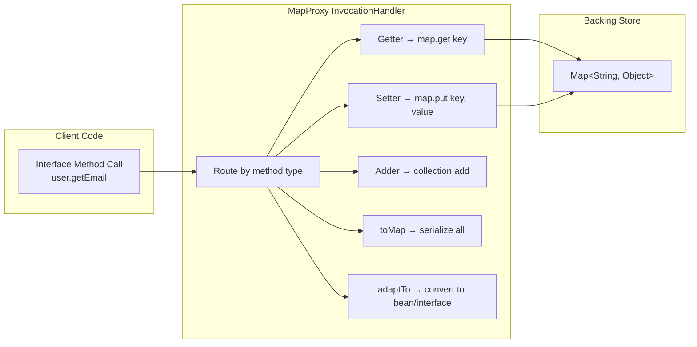
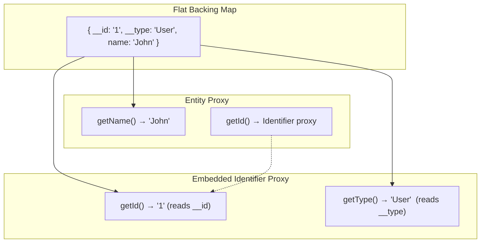
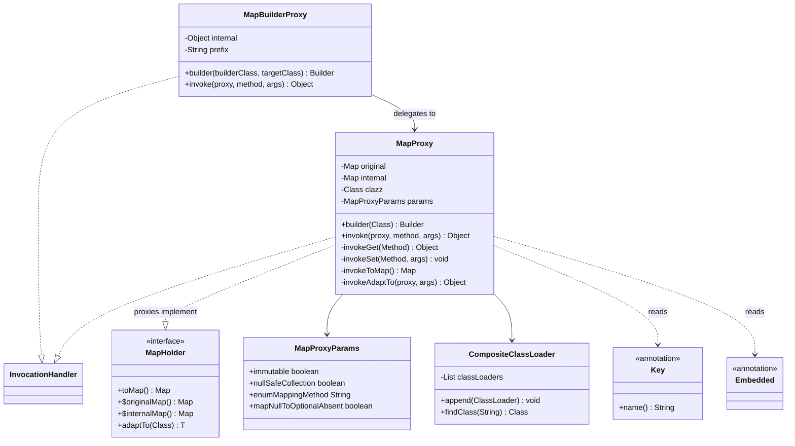
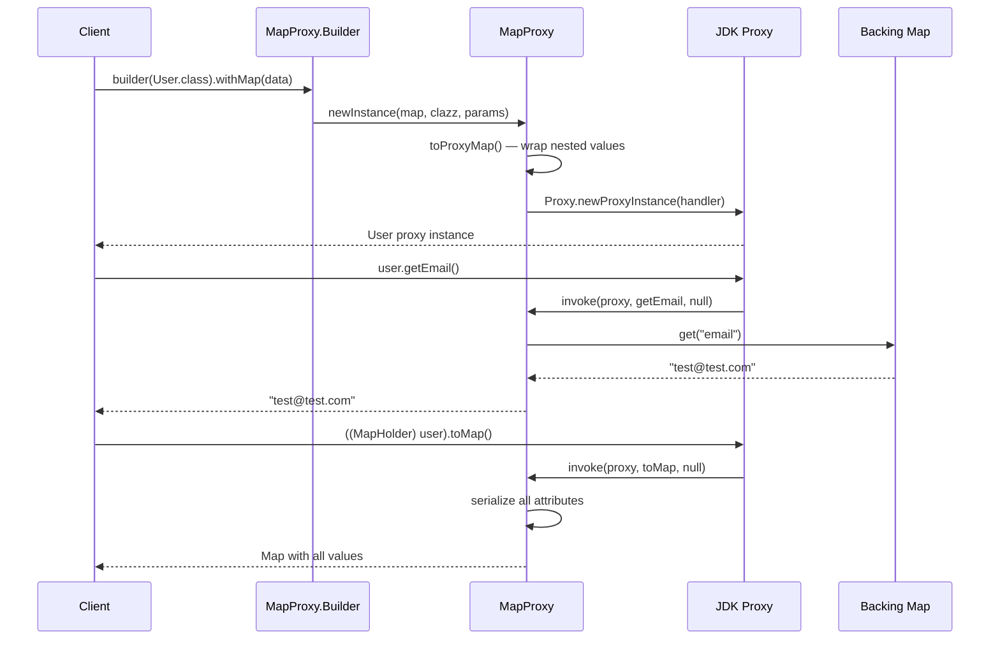
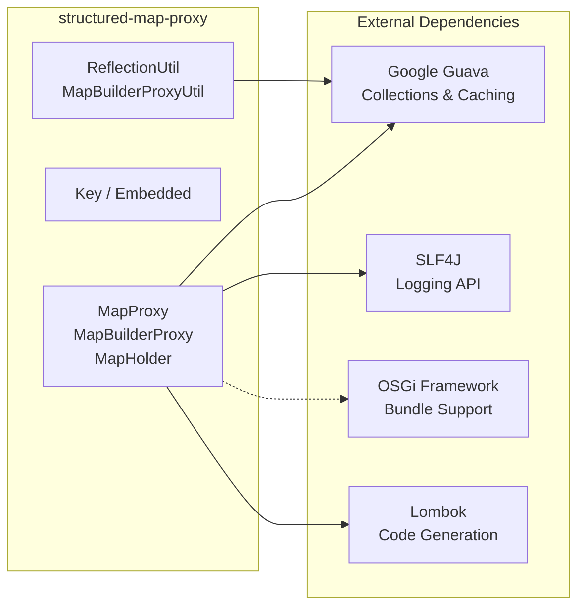

# Structured Map Proxy

[](https://github.com/BlackBeltTechnology/structured-map-proxy/actions/workflows/build.yml)

## What Is This Library?

Structured Map Proxy creates **type-safe Java interface proxies** backed by `java.util.Map` instances. Instead of working with raw maps and casting values manually, you define Java interfaces with getters and setters, and the library generates dynamic proxies that read from and write to an underlying map — following JavaBean naming conventions.

This is particularly useful when you need to:
- Provide a typed API over dynamic data structures (e.g., JSON-to-Map deserialized data)
- Define hierarchical object graphs using interface composition without concrete classes
- Convert between maps, proxies, and Java beans seamlessly

All proxies implement the `MapHolder` interface, which provides direct access to the underlying map and supports conversion to other types:

```java
public interface MapHolder {
    Map<String, Object> toMap();
    Map<String, Object> getOriginalMap();
    <T> T adaptTo(Class<T> clazz);
}
```

## How It Works

The core mechanism uses `java.lang.reflect.Proxy` with a custom `InvocationHandler` (`MapProxy`). When you call a getter like `getEmail()`, the handler looks up `"email"` in the backing map. When you call `setEmail("x")`, it stores `"x"` under the `"email"` key. Nested interfaces, collections, optionals, and enums are all handled automatically.



## Installation

Add to your `pom.xml`:

```xml
<dependency>
  <groupId>hu.blackbelt</groupId>
  <artifactId>structured-map-proxy</artifactId>
  <version>LATEST</version>
  <type>bundle</type>
</dependency>
```

## Usage Guide

### Defining Interfaces

Define your domain model as plain Java interfaces with getter/setter pairs. The library maps method names to map keys using JavaBean conventions: `getStringValue()` / `setStringValue()` maps to the key `"stringValue"`.

```java
public interface Identifier extends Serializable {
    @Key(name = "__id")
    Serializable getId();
    void setId(Serializable id);

    @Key(name = "__type")
    String getType();
    void setType(String id);
}

public interface Entity extends Serializable {
    @Embedded
    Identifier getId();
    void setId(Identifier id);

    @Embedded
    Identifier identifier();
}

public interface User extends Entity {
    Boolean getActive();
    void setActive(Boolean active);

    String getEmail();
    void setEmail(String email);

    Optional<String> getFirstName();
    void setFirstName(String firstName);

    @Key(name = "last_name")
    Optional<String> getLastName();
    void setLastName(String lastName);

    UserDetail getSingleUserDetail();
    void setSingleUserDetail(UserDetail userDetail);

    Collection<UserDetail> getUserDetails();
    void setUserDetails(Collection<UserDetail> userDetails);
}

public interface UserDetail {
    @Embedded
    Identifier getId();
    void setId(Identifier id);

    String getNote();
    void setNote(String note);
}
```

### Creating a Proxy from a Map

```java
Map<String, Object> prepared = new HashMap<>();
prepared.put("active", true);
prepared.put("__id", "1");
prepared.put("__type", "user");
prepared.put("email", Optional.of("test@test.com"));
prepared.put("last_name", Optional.of("teszt"));
prepared.put("userDetails", ImmutableList.of(
    ImmutableMap.of("__id", "1", "__type", "UserDetail", "note", "Note1")
));

User user = MapProxy.builder(User.class)
        .withMap(prepared)
        .newInstance();

user.setEmail("another@example.com");
```

### Creating a Map from a Proxy

```java
User user = MapProxy.builder(User.class).newInstance();
user.setActive(true);
user.setLoginName("teszt");

UserDetail detail = MapProxy.builder(UserDetail.class).newInstance();
detail.setNote("Note1");
user.setUserDetails(ImmutableList.of(detail));

Map<String, Object> mapRepresentation = ((MapHolder) user).toMap();
```

### Builder Interfaces

For a fluent construction API, define a builder interface with a `build()` method that returns the target type:

```java
public interface UserBuilder {
    UserBuilder active(Boolean par);
    UserBuilder email(String par);
    UserBuilder firstName(String par);
    UserBuilder lastName(String par);
    UserBuilder userDetails(Collection<UserDetail> userDetails);
    User build();
}
```

```java
User user = MapBuilderProxy.builder(UserBuilder.class, User.class).newInstance()
     .active(true)
     .email("test@test.com")
     .build();
```

### Bean Conversion with `adaptTo()`

Convert a proxy to a concrete Java bean class. The library matches getter names to setter names and recursively converts nested objects:

```java
User user = MapBuilderProxy.builder(UserBuilder.class, User.class).newInstance()
     .active(true)
     .email("teszt")
     .build();

UserBean bean = user.adaptTo(UserBean.class);
```

## Annotations

Annotations are placed on **getter methods** to customize the mapping between the interface and the backing map.

| Annotation | Purpose | Example |
|---|---|---|
| `@Key(name = "...")` | Use a custom map key instead of the JavaBean-derived name | `@Key(name = "__id") Serializable getId()` |
| `@Embedded` | Flatten a nested interface's fields into the parent map (no nesting in the map) | `@Embedded Identifier getId()` |

### How `@Embedded` Works

When `@Embedded` is placed on a getter returning an interface type, the nested interface's fields are stored at the **same level** in the backing map — they are not nested under a sub-key. This lets you decompose a flat map into multiple typed views.



## Static Method Overrides

You can define static methods on interfaces to override `hashCode`, `toString`, and `equals` behavior on the proxy:

```java
public interface UserDetail {
    String getId();
    String getNote();

    static String toString(UserDetail o1) {
        return String.format("{ id: %s, note: %s }",
                Objects.toString(o1.getId(), "null"),
                Objects.toString(o1.getNote(), "null"));
    }

    static boolean equals(UserDetail o1, Object o2) {
        if (o2 == null) return false;
        if (UserDetail.class.isAssignableFrom(o2.getClass())) {
            return o1.getId().equals(((UserDetail) o2).getId());
        }
        return false;
    }

    static int hashCode(UserDetail o) {
        return o.getId().hashCode();
    }
}
```

If not defined, `toString()` prints all fields, and both `hashCode()` and `equals()` delegate to the `toString()` representation.

## Configuration Options

Options are set via the builder when creating a proxy:

| Option | Default | Description |
|---|---|---|
| `withImmutable(true)` | `false` | All mutating operations (`set*`, `addTo*`, `removeFrom*`) throw `IllegalStateException` |
| `withNullSafeCollection(true)` | `false` | Unset collections return an empty collection instead of `null` |
| `withEnumMappingMethod(method)` | `"name"` | Controls how enums are serialized/deserialized to the map (`name`, `ordinal`, or a custom method) |
| `withMapNullToOptionalAbsent(true)` | `false` | Missing values return `Optional.empty()` instead of `null` |

### Builder-Specific Options

`MapBuilderProxy` supports all `MapProxy` options plus:

| Option | Default | Description |
|---|---|---|
| `withBuilderMethodPrefix("with")` | none | Allows builder methods to have a prefix (e.g., `withEmail()` instead of `email()`) |

## System Properties

| Property | Default | Description |
|---|---|---|
| `structuredMapProxyCacheExpireInSecond` | `60` | Cache TTL in seconds for method/field descriptor caches (Guava `LoadingCache`) |

## Architecture Overview







## Contributing

See [CONTRIBUTING.md](CONTRIBUTING.md) for setup instructions and submission guidelines.

## License

This project is licensed under the [Apache License 2.0](https://www.apache.org/licenses/LICENSE-2.0).
